# 便签系统

一个用 PHP + SQLite 写的轻量便签站。支持照片上传、三种可见性，以及**服务端零密钥**的加密便签。

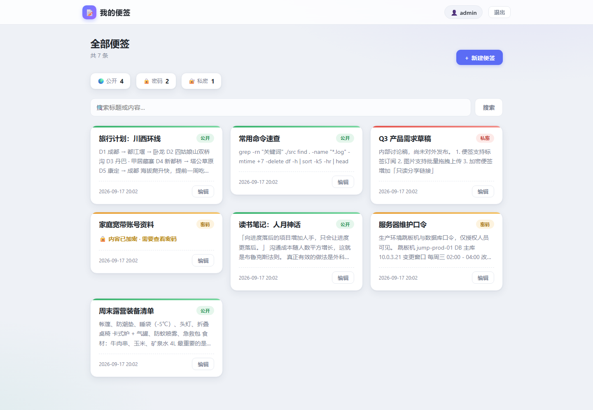

## 特性

| | |
|---|---|
| **三种可见性** | 公开 / 密码保护 / 仅登录 |
| **真正的加密** | Argon2id 派生密钥 + XSalsa20-Poly1305（libsodium），密钥不落盘 |
| **照片独立存储** | 数据库只存元数据，图片文件单独放 `photos/` |
| **单张照片删除** | 每张照片右上角 ✕，删照片与删便签互不影响 |
| **无外部依赖** | 不需要 MySQL、不需要 Composer、不需要 `fileinfo` |

## 界面

**主页** —— 卡片式列表，按可见性用不同颜色区分；未解锁的加密便签只显示占位提示。


**密码便签** —— 解锁后正文与照片一并解密。

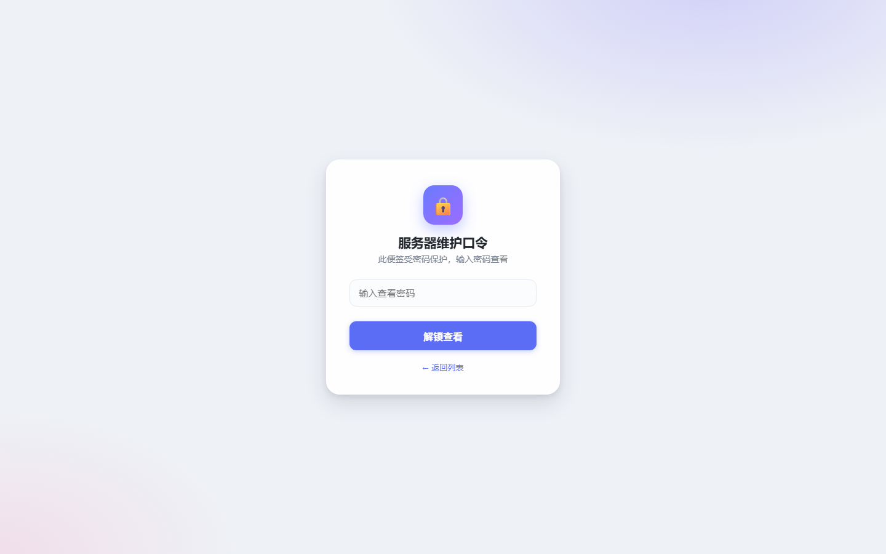

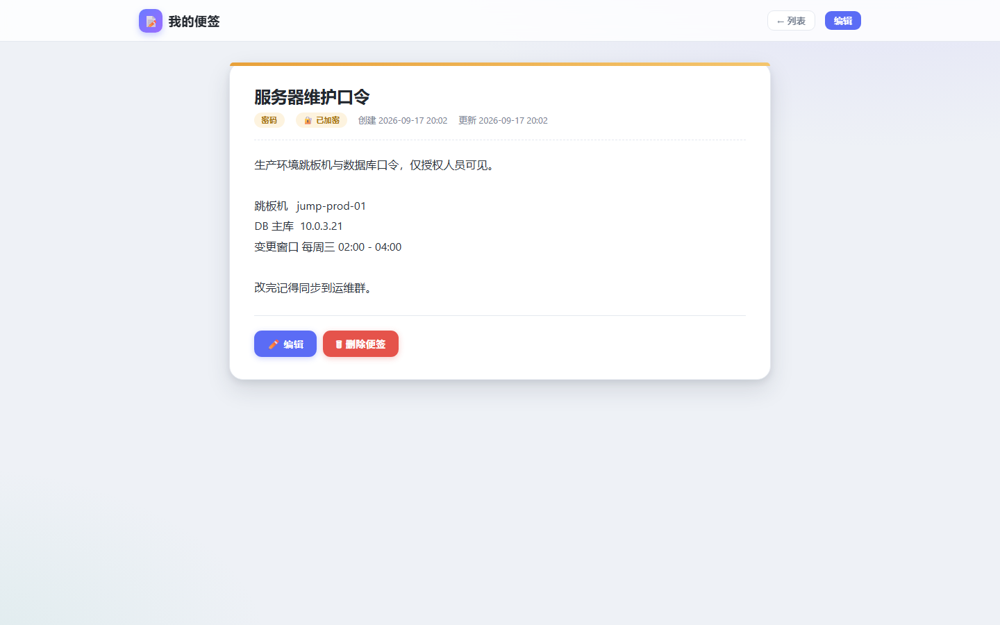

**照片墙** —— 多列瀑布流，按原始比例排布，不裁图、不留空洞。

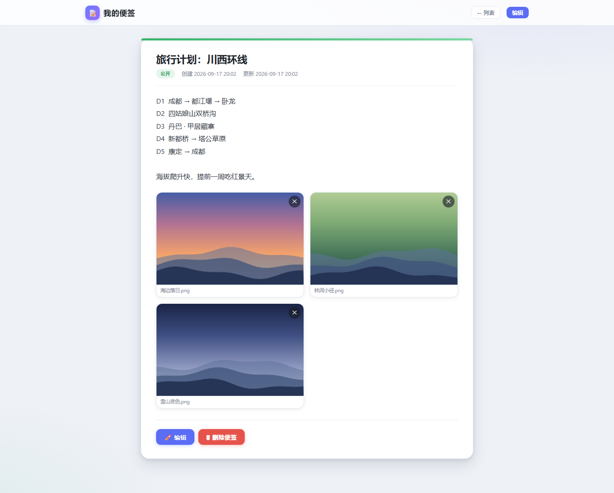

**新建 / 编辑** —— 支持多选上传，带进度条。

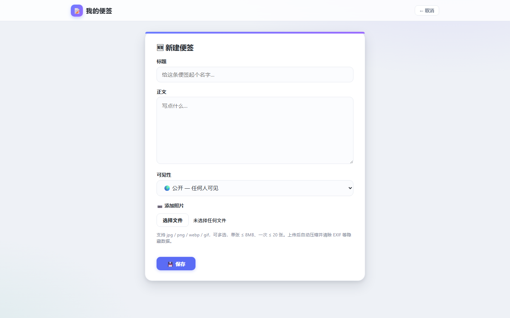

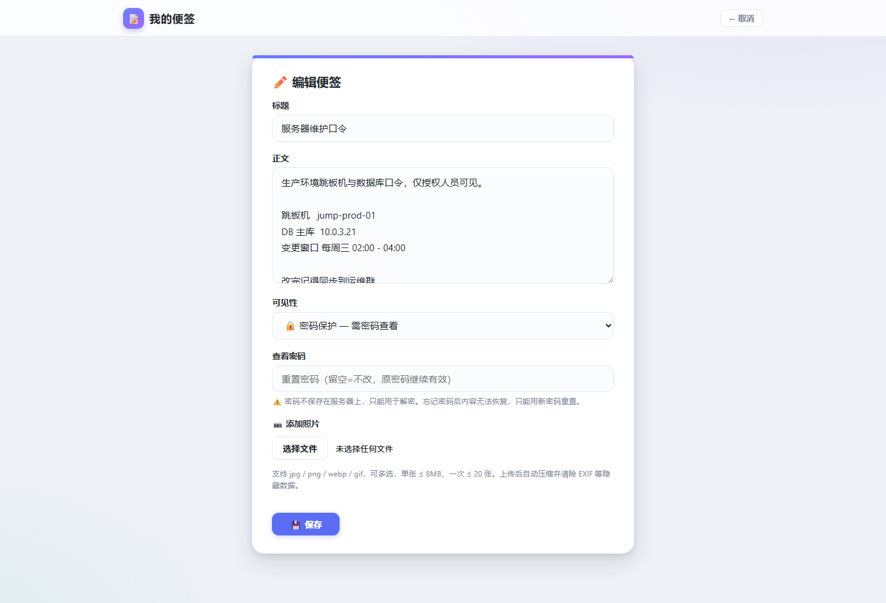

已上传的照片会在编辑页列出，可继续追加：

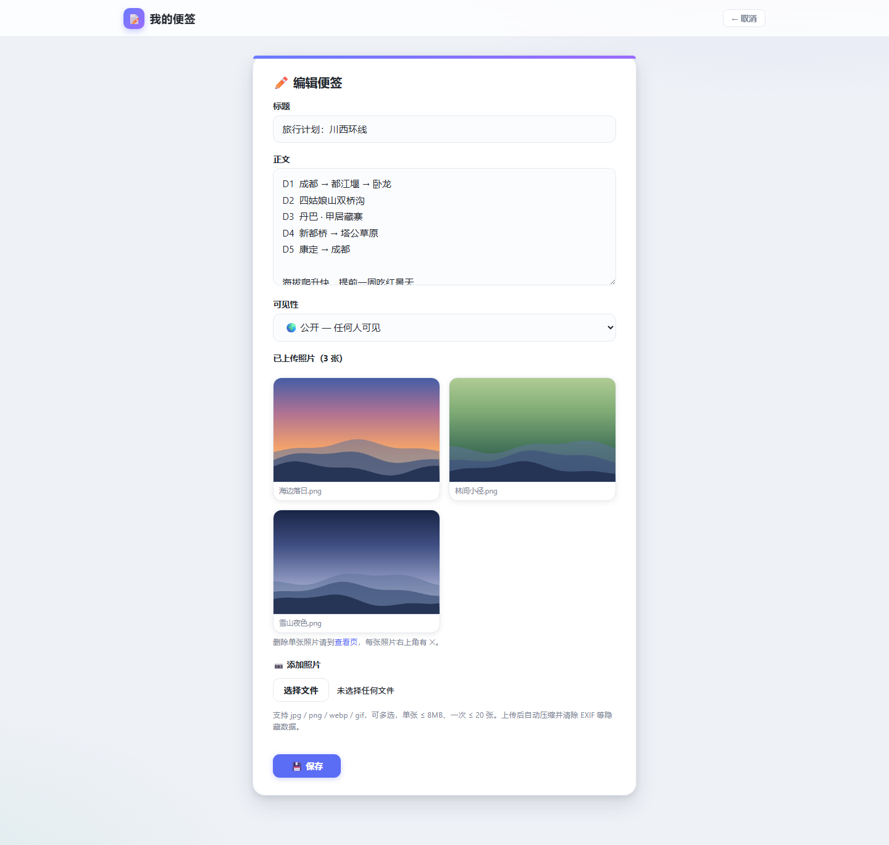

**私密便签** —— 未登录直接 403，登录后可见。

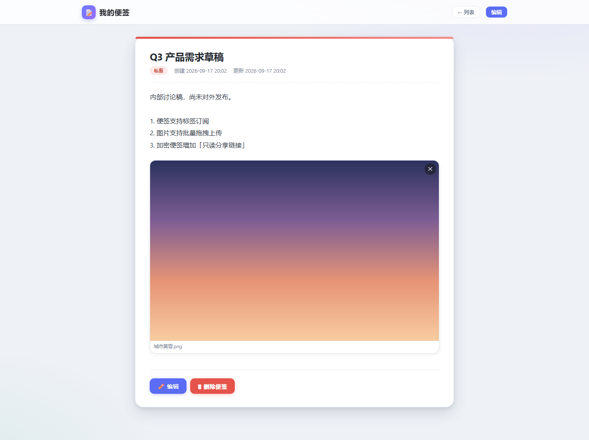

**移动端**

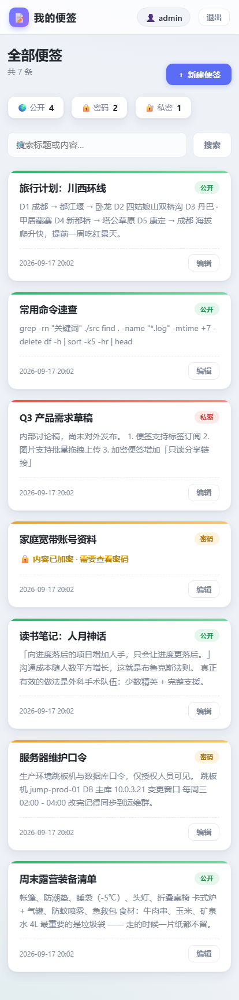

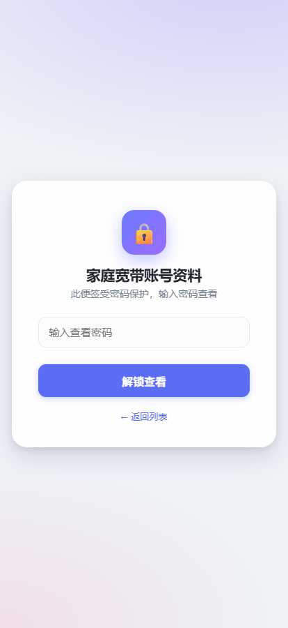

**登录页**

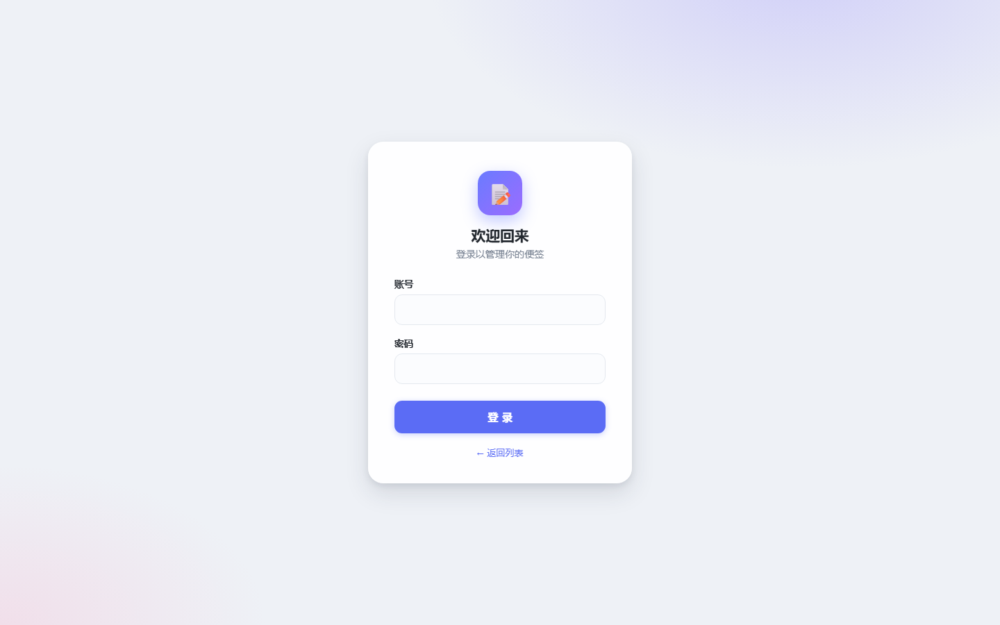

## 目录结构

```
index.php           主页 = 便签列表
view.php            便签详情；管理员可在此单张删除照片
edit.php            新建/编辑便签 + 上传照片（带进度条）
login.php           登录；首次访问时初始化管理员账号
photo.php           照片输出（加密便签的照片在这里解密）
delete.php          删除整条便签（含其全部照片）
photo_delete.php    只删除某一张照片
logout.php
router.php          内置服务器入口（同时拦截内部目录）
style.css
app/                内部库，web 不可达
  lib.php           数据库 / 会话 / CSRF / 访问限速
  crypto.php        sodium 加解密
data/app.db         SQLite（便签、用户、照片元数据）
photos/*.bin        照片文件（加密便签的为密文）
screenshots/        README 用的界面截图
```

## 部署

### 环境要求

- PHP **8.0+**，需开启 `pdo_sqlite`、`sodium`、`gd`、`mbstring`
- Web 服务器：nginx 或 Apache
- 对 `data/` 与 `photos/` 目录有写权限

### 1. 上传代码

把整个项目放到站点根目录，**站点根指向本项目根**（`index.php` 即主页）。

### 2. 设置目录权限

```bash
chown -R www:www data photos
chmod 750 data photos
```

### 3. 配置伪静态（必做）

> **这一步不能跳过。** `app/`、`data/`、`photos/` 必须在 Web 层不可达，
> 否则 `data/app.db` 会被任何人直接下载（里面有管理员密码哈希和全部便签密文）。

#### nginx

填到站点配置或宝塔的「伪静态」中：

```nginx
# ACME 证书校验必须放行，否则 HTTPS 续签会失败
location ^~ /.well-known/acme-challenge/ { allow all; }

# 内部目录。边界用 (/|$) 锚定，避免 datax / myapp 被误伤
if ($uri ~* "/(app|data|photos|_bak)(/|$)") { return 403; }

# router.php 仅供本地调试，线上必须拒绝（否则会被当成脚本执行）
if ($uri ~* "(^|/)router\.php$") { return 403; }

# 隐藏文件（.env/.htaccess/.git），但放过 .well-known
if ($uri ~* "(^|/)\.(?!well-known)") { return 403; }

# 危险后缀（备份包不要放在网站根目录）
if ($uri ~* "\.(bak|orig|old|db|db-wal|db-shm|sqlite|sqlite3|ini|log|md|txt|bin|zip|tar|gz|7z|rar|sql)$") { return 403; }
```

用 `if` 而不是 `location ^~` 的原因有两点：

1. **不受规则顺序影响。** `if` 在 location 匹配**之前**求值，不会被
   `location ~ \.php`（宝塔的 `enable-php`）按定义顺序抢走。
   实测用 `location ~ ^/(app|data|...)` 时，`/app/lib.php`、`/router.php`
   仍会被当成 PHP **执行**。
2. **不受部署层级影响。** `location ^~ /data/` 匹配的是 URI 全路径，
   站点放在子目录时会失配；`if ($uri ~ ...)` 搜全路径，放哪层都生效。

#### Apache

项目根目录的 `.htaccess` 已经写好，确保 `AllowOverride` 包含 `FileInfo`：

```apache
Options -Indexes
RedirectMatch 403 (?i)(^|/)(app|data|photos|_bak)(/|$)
RedirectMatch 403 (?i)(^|/)router\.php$
RedirectMatch 403 (?i)(^|/)\.(?!well-known)
RedirectMatch 403 (?i)\.(bak|orig|old|db|db-wal|db-shm|sqlite|sqlite3|ini|log|md|txt|bin|zip|tar|gz|7z|rar|sql)$
```

### 4. 调整上传限制

`php.ini`：

```ini
upload_max_filesize = 20M
post_max_size = 25M
```

> 若 `post_max_size` 太小，上传会在 PHP 层被整个丢弃。此时页面会明确提示
> 「上传内容 X MB 超过服务器 post_max_size」，而不是含糊的 CSRF 报错。

### 5. 验证

浏览器打开下面地址，**都应该是 403 Forbidden**：

```
https://你的域名/data/app.db
https://你的域名/app/lib.php
https://你的域名/router.php
```

任何一个返回 200 或直接下载，都说明伪静态没生效，**数据库正在被公开下载**。

### 6. 创建管理员

首次打开 `login.php` 会自动进入「初始化管理员」流程，设置账号与密码即可。
密码用 bcrypt 存储，账号密码只存在本机数据库。

## 使用说明

### 三种可见性

| 可见性 | 谁能看 | 存储方式 |
|---|---|---|
| 🌍 公开 | 任何人 | 明文 |
| 🔒 密码保护 | 知道查看密码的人 | 正文与照片均加密 |
| 🔐 私密 | 登录用户 | 明文（靠访问控制保护） |

### 关于加密

加密便签的流程是：

1. 用查看密码 + 随机盐，经 `sodium_crypto_pwhash`（Argon2id）派生 32 字节密钥
2. 正文与每张照片都用 `crypto_secretbox`（XSalsa20-Poly1305）加密后落盘
3. 密钥**只存在会话里**，服务器不持久化

由此带来两个必须理解的行为：

- **管理员也要输查看密码。** 密码不在服务端保存，无从"绕过"，这是加密成立的前提。
- **密码无法找回。** 用新密码编辑会重新加密内容，旧密码立即失效，旧内容无法恢复。

便签标题始终是明文（用于列表展示），正文与照片才是密文。

### 照片

- 白名单 `jpg / png / webp / gif`，单张 ≤ 8MB、一次 ≤ 20 张
- 上传后统一经 GD 重编码，剥离 EXIF 与潜在脚本载荷
- 数据库存 `id / note_id / orig_name / mime / stored_name / size / encrypted`，二进制存 `photos/*.bin`
- 删单张照片：查看页每张照片右上角 ✕
- 删整条便签：详情页底部「删除便签」，会级联删除其全部照片

## 数据模型

```sql
users   (id, username UNIQUE, password_hash, created_at)
notes   (id, title, body, visibility, encrypted, salt, created_at, updated_at)
photos  (id, note_id → notes.id ON DELETE CASCADE, orig_name, mime,
         stored_name UNIQUE, size, encrypted)
throttle(k, fails, last)          -- 登录/解锁失败计数（按 IP）
```

`visibility` 取值：`public` / `password` / `private`。

## 安全设计

- 管理员密码用 `password_hash`（bcrypt）存储
- 便签与照片用 Argon2id 派生密钥 + `crypto_secretbox` 加密
- 所有写操作校验 CSRF token
- 登录与解锁失败按 IP 计数限速（超过 5 次退避 1→64 秒，15 分钟无动作清零）；
  计数存在数据库而非 Session，丢 Cookie 无法重置
- 会话 Cookie：`HttpOnly` + `SameSite=Lax`，HTTPS 下自动加 `Secure`
- 登录成功与解锁成功均 `session_regenerate_id`，防会话固定
- 图片经 GD 重编码后再落盘，杜绝伪装成图片的脚本
- 储存路径用随机文件名（`bin2hex(random_bytes(16)).bin`），不暴露原始文件名
- 生产环境 `display_errors=0`

## 备份

需要备份的只有两样：

```
data/app.db      数据库（便签、用户、照片元数据）
photos/          照片文件
```

> 加密便签的正文与照片是密文，但**密钥不在备份里**（不落盘）。
> 备份泄露不等于内容泄露；反过来，忘了查看密码，备份也救不回来。

## 许可

MIT